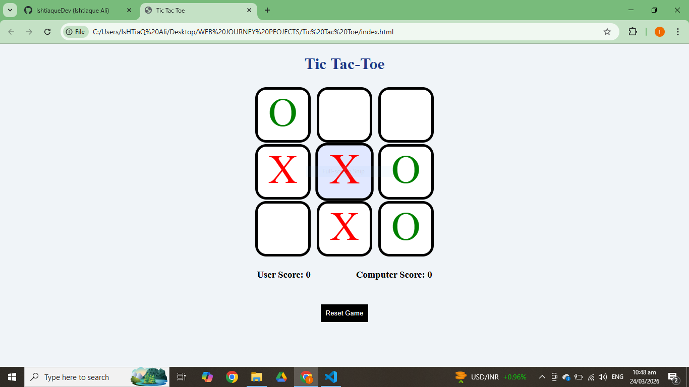

# Tic Tac Toe

I built a Tic Tac Toe game using HTML, CSS, and JavaScript.

This project helped me improve my logical thinking by implementing concepts like:
- Random turn generation
- Winning sequence detection
- Loops and conditional logic

## Author
- Ishtiaque Ali

## Feedback
If you have any suggestions, feel free to open an issue or contact me.
